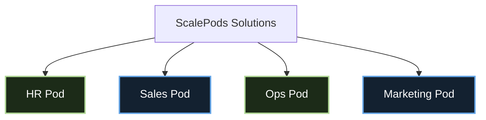

# ScalePods Brand Kit Specification & Reference Report

This report outlines the official ScalePods visual identity system, product messaging frameworks, approved performance metrics, and content-writing rules. It serves as the single source of truth for all marketing assets, template designs, and social media media creations.

---

## 1. Executive Summary & Brand Positioning

ScalePods designs and deploys autonomous, agent-based AI systems ("Pods") that automate complex workflows, lower overhead, and enable companies to scale operations without adding headcount.

* **Core Value Proposition**: Deploying autonomous agentic AI ecosystems that handle repetitive operational busywork, ensuring lean, high-output teams.
* **Tone & Voice**: Developer-first, professional, precise, data-driven, and entirely free of marketing fluff or hyperbole.

---

## 2. Visual Identity & Assets

### 2.1 Brand Logo Assets
All logo assets are located in the `brand-kit/logo/` folder:
* **`scalepods-logo.png` (Default Wordmark)**: Black typography. Best suited for light-colored background templates (such as Cream/Mint-Alabaster).
* **`logo-light.png` (Light Wordmark)**: White typography. Best suited for dark green or dark cyber-navy backgrounds.
* **`icon.png` (Symbol)**: The dotted-circle icon mark. Used for profile avatars, social stamps, or smaller square icon layouts.

**Usage Rules:**
* **Clear Space**: Ensure a minimum margin of **24px** around the logo on all sides.
* **Alignment**: Place logos in either the top-center or top-left of assets, depending on the layout style.

### 2.2 Brand Typography Stack
All fonts are located in the `brand-kit/fonts/` folder:
* **Primary Sans-Serif**: `Inter` (woff2 files copied). Use weights `400` (Regular), `500` (Medium), and `600` (SemiBold) for body copy, labels, lists, and numbers.
* **Headline Font**: `Inter-Bold` (`700` weight) is used for title headings (often in Uppercase for badges/labels).
* **Editorial Accent Font**: `Instrument Serif` (Italic, weight `400` only) is used for specific italicized accent words in hero headings to add a high-end editorial contrast.

**Styling Rules:**
* **Headlines**: Use Title Case (700 weight). Badge headers use Uppercase (700 weight).
* **Body/Labels**: Use Sentence Case (400 or 500 weight).
* **Monospace Stack**: Fall back to standard monospaced families (`Menlo`, `Monaco`, `Consolas`, `Fira Code`) for technical text or process paths.

### 2.3 Color Tokens & Palette
These hex codes match the production site exactly:

| Token / Role | Hex Code | R/G/B Channels | Context & Usage |
| :--- | :--- | :--- | :--- |
| **Primary Page Background** | `#04070D` | `4, 7, 13` | Deep Cyber Navy-Black for default dark backgrounds. |
| **Card Background** | `#080A0E` | `8, 10, 14` | Used for cards and panels, generally with 55% transparency. |
| **Alternative Panel Background** | `#10131C` | `16, 19, 28` | Deep Slate Navy for high-contrast secondary containers. |
| **Primary Accent Green (Sage)** | `#B1D997` | `177, 217, 151` | Default accent color for HR & Ops pages. Used for key headlines, icons, and button highlights. |
| **Light Mode Green Text** | `#8FBC6A` | `143, 188, 106` | Optimized darker green for high accessibility contrast against light backgrounds. |
| **Primary Accent Blue (Electric)** | `#63A5E7` | `99, 165, 231` | Default accent color for Sales & Marketing pages. |
| **Light Mode Blue Text** | `#408CD6` | `64, 140, 214` | Optimized darker blue for contrast on light backgrounds. |
| **Terracotta Orange (Claude)** | `#CC6B49` | `204, 107, 73` | Highlight color for Anthropic/Claude partnership badges and warning indicators. |
| **Mint-Alabaster (Cream Background)** | `#F8FAF7` | `248, 250, 247` | Used for clean, light mode post templates. |

---

## 3. Product Pod Specifications & Metrics
ScalePods operates four distinct automation lines. Each has specific taglines, descriptions, and verified performance metrics from the core website pages.

### 3.1 HR Pod
* **Focus**: Automates candidate sourcing campaigns, screening, calendar coordination, and onboarding setup.
* **Tagline**: *Screen. Shortlist. Hire.*
* **Badge Label**: `HR POD`
* **Accent Color**: `#B1D997` (Sage Green)
* **Approved Stats & Metrics**:
  * **10x** Faster Candidate Screening
  * **80%** Less Manual Coordination (80% Coordination Reduction)
  * **5 Hours** Saved Per Recruiter / Week
  * **48-Hour** Timeline from Brief to Interview Setup
  * **100%** Objective Resume Shortlisting based on structured compliance rules

### 3.2 Sales Pod
* **Focus**: Executes multi-channel outreach campaigns (Email, LinkedIn), tracks intent data, updates CRMs, and books qualified sales meetings.
* **Tagline**: *Outreach. Engage. Book.*
* **Badge Label**: `SALES POD`
* **Accent Color**: `#63A5E7` (Electric Blue)
* **Approved Stats & Metrics**:
  * **500+** CRM Data Entries/Updates Automated
  * **70%** Faster Lead Response Time
  * **8 Hours** Saved Per Rep / Week
  * **3-Second** Automated Response Time on Initial Lead Ingestion
  * **3x** Reply Rates compared to single-channel outbound outreach
  * **60%** Less Manual Admin Work for reps
  * **40%** Increase in Meetings Booked

### 3.3 Operations (Ops) Pod
* **Focus**: Automates multi-document compliance auditing, cross-checking weights, invoices, E-way bills, GSTIN numbers, and transaction logs.
* **Tagline**: *Upload. Verify. Approve.*
* **Badge Label**: `OPS POD`
* **Accent Color**: `#B1D997` (Sage Green)
* **Approved Stats & Metrics**:
  * **100%** Document Audit Coverage & Field Cross-Checking
  * **90%** Faster Document Verification
  * **Zero** Compliance Slippages
  * **<60 Seconds** processing time from File Upload to Verification (down from 45 minutes for manual matching)
  * **14+** Fields Automatically Verified per audit (Invoices, HSN codes, batch numbers, weights, GSTINs)

### 3.4 Marketing Pod
* **Focus**: Autonomous content repurposing, multi-platform publishing scheduler, and campaign analyst.
* **Tagline**: *Brief. Produce. Publish.*
* **Badge Label**: `MARKETING POD`
* **Accent Color**: `#63A5E7` (Electric Blue)
* **Approved Stats & Metrics**:
  * **10x** Faster Content Production (10x Content Output)
  * **80%** Less Manual Coordination across platforms
  * **40%** Increase in Marketing Team Efficiency
  * **<24 Hours** turn-around from Initial Brief to Multi-Platform Publication
  * **3x** Increase in Active Marketing Channels Covered (repurposing core assets)

---

## 4. Design Aesthetics & Styling Guide

### 4.1 Background Architecture
* **Dark Aesthetics**: Dark backgrounds use a base of `#04070D` with translucent cards (`#080A0E` at `0.55` opacity).
* **Light/Cream Aesthetics**: Light templates use `#F8FAF7` (Mint-Alabaster) with clean borders.
* **Patterns**: Subtle grid or circuit vector patterns should use a color offset with a very low opacity (`0.02` to `0.04`).

### 4.2 Pills & Interactive Elements
* **Badge Pills**: Fill with `rgba(177, 217, 151, 0.1)` (semi-transparent green glow) or `rgba(99, 165, 231, 0.1)` (blue glow) with a matching `1px` border. Text color should be the solid accent color.
* **Call-to-Action Pills**: Use solid fill `#B1D997` (Sage) or `#63A5E7` (Blue) with high-contrast text (`#0B1A08` or `#04070D`).

### 4.3 Iconography
* **Style**: Minimalist, technical line art (matches Lucide design).
* **Line Weight**: Medium (`1.5px` or `2.0px`).
* **Color**: Always match the active Pod’s accent color.

---

## 5. Copywriting & Compliance Rules

To maintain high professional standards, content creators must follow these rules strictly:

* **Approved CTA Prompts**:
  * *"Comment SCALEPODS to evaluate your workflow"*
  * *"Book an Automation Audit"*
  * *"Link in bio to book a demo"*
* **Do NOT Hallucinate Stats**: Never create stats (e.g. claiming exact dollar savings, cost cuts, or team replacements) not explicitly defined in Section 3.
* **Forbidden Phrases**: Avoid generic marketing jargon like *"revolutionary"*, *"next-gen"* (unless explaining technical generations), *"magic"*, or claims that ScalePods *"completely replace human employees"*. Focus on *work capacity multipliers* and *eliminating busywork*.

---

## 6. Social Media & Output Dimensions

All created creative assets should conform to these target resolutions:
1. **Instagram Feed Portrait (4:5)**: `1080px × 1350px` (Primary design standard).
2. **Instagram Story / Reel Covers (9:16)**: `1080px × 1920px`.
3. **LinkedIn Carousel / Square (1:1)**: `1080px × 1080px`.
