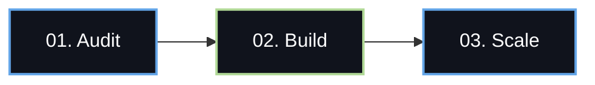

# ScalePods Business Knowledge Base & Content Creation Playbook

This document compiles the core business logic, technical details, product positioning, and verified client case studies for ScalePods. It is specifically designed to support Instagram content generation (carousels, slides, captions, and single-image posts).

---

## 1. Core Brand Positioning & Messaging Hierarchy

ScalePods helps businesses scale operations and revenue without increasing overhead by deploying autonomous AI Agent ecosystems ("Pods").

* **The Problem**: High labor costs, human coordination delays, administrative busywork, data entry mistakes, and teams spending 80% of their time on repetitive tasks instead of high-value growth.
* **The Solution**: Deploying autonomous, tool-integrated agent ecosystems that work 24/7, cross-check their own outputs, update tools, and integrate directly with existing databases (Slack, CRMs, ATS, Calendars).
* **The ScalePods Difference**: Ready-to-go workflows that are custom-tuned to a company's specific stack, backed by enterprise-grade security (GDPR/compliance), running on advanced Claude LLM architectures.

### Content Hook Angles for Instagram:
* *"Stop hiring manual data entry. Deploy an autonomous Pod instead."*
* *"What if your operations team could review 100% of invoices in under 60 seconds?"*
* *"Your sales reps are spending 8 hours a week updating CRM. Here is how we automated it."*
* *"Scale your capacity, not your payroll. The rise of autonomous business units."*

---

## 2. The Four Core ScalePods: Detailed Profiles

Use these sections to build dedicated carousels or single-feature posts for each product line.

### 2.1 The HR Pod (Hiring & Onboarding)
* **One-liner**: An autonomous recruitment assistant that manages job posts, parses resumes, schedules interviews, and prepares onboarding packets.
* **Tagline**: *Screen. Shortlist. Hire.*
* **Primary Color/Accent**: Sage Green (`#B1D997`)
* **Core Channels/Integrations**: LinkedIn Jobs, Indeed, Greenhouse, Lever, Google/Outlook Calendars, Slack, DocuSign.
* **Verified Stats for Posts**:
  * **10x** faster candidate screening loop.
  * **80%** reduction in manual scheduling and calendar coordination.
  * **5 hours** saved per recruiter, every single week.
  * **48 hours** from initial campaign brief to booked interviews.
  * **100%** objective shortlisting (every applicant evaluated against identical structured guidelines, eliminating human filter bias).

### 2.2 The Sales Pod (Outreach & Pipeline)
* **One-liner**: An autonomous outbound engine that sources intent-data leads, triggers multi-channel campaigns, qualifies responses, and schedules sales calls.
* **Tagline**: *Outreach. Engage. Book.*
* **Primary Color/Accent**: Electric Blue (`#63A5E7`)
* **Core Channels/Integrations**: LinkedIn, Outreach.io, Cold Email Servers, HubSpot, Salesforce, ZoomInfo, Apollo.
* **Verified Stats for Posts**:
  * **500+** CRM records qualified and updated automatically.
  * **70%** faster response times to inbound leads.
  * **8 hours** saved per sales representative per week (eliminating data entry).
  * **3 seconds** to trigger outbound engagement the moment a lead enters.
  * **3x** higher reply rates using coordinated LinkedIn + Email multi-channel sequencing.
  * **60%** less manual outreach admin task load.
  * **40%** increase in qualified meetings booked.

### 2.3 The Operations (Ops) Pod (Compliance & Auditing)
* **One-liner**: An autonomous compliance officer that cross-checks invoices, purchase orders, shipping bills, and tax structures (GSTIN) instantly.
* **Tagline**: *Upload. Verify. Approve.*
* **Primary Color/Accent**: Sage Green (`#B1D997`)
* **Core Channels/Integrations**: PDF parsers, ERPs (SAP, NetSuite), tax database APIs, WhatsApp alerts, warehouse scanners.
* **Verified Stats for Posts**:
  * **100%** audit coverage (cross-checking every single document instead of risky spot-checking).
  * **90%** faster document verification compared to manual checks.
  * **Zero** compliance slippages or double-payments.
  * **<60 seconds** to upload, verify, and approve transaction records (replaces a 45-minute physical comparison process).
  * **14+** distinct data fields cross-checked per transaction (weights, GSTIN, HSN codes, invoice numbers, chemistry data, batch details).

### 2.4 The Marketing Pod (Content & Repurposing)
* **One-liner**: An autonomous content engine that converts a single core asset (like a video or article) into multi-format, platform-optimized social campaigns.
* **Tagline**: *Brief. Produce. Publish.*
* **Primary Color/Accent**: Electric Blue (`#63A5E7`)
* **Core Channels/Integrations**: LinkedIn, Twitter/X, Instagram, Substack, YouTube, Mailchimp.
* **Verified Stats for Posts**:
  * **10x** content production output.
  * **80%** less manual platform coordination and copy-pasting.
  * **40%** increase in overall marketing team efficiency.
  * **<24 hours** from raw asset/brief upload to multi-platform publishing.
  * **3x** increase in social channel coverage without adding content writing staff.

---

## 3. The 3-Step ScalePods Implementation Methodology

This framework makes a perfect "How it works" carousel post.

* **Step 01: Discover & Analyze**
  * *What we do*: We audit your existing workflows, manual spreadsheets, and database logs to identify exactly where your team is wasting hours.
  * *Slide Hook*: *Identify the Bottlenecks.*
* **Step 02: Design & Implement**
  * *What we do*: We construct the custom agent schemas, hook up integrations via APIs, configure fallback rules, and deploy the Pod live into your current stack.
  * *Slide Hook*: *Connect the Pipes.*
* **Step 03: Optimize & Scale**
  * *What we do*: We track execution success rates, refine agent reasoning parameters, and expand capabilities to cover additional business tasks.
  * *Slide Hook*: *Turn on the Autopilot.*

---

## 4. Case Studies: Problem $\rightarrow$ Solution Carousel Narrative

Use these verified case study scripts to write high-engagement story slide decks.

### Case Study A: The Expo Automation Success
* **Category**: Exhibition Leads / Real-Time Marketing
* **The Problem**: A client attending a massive industry expo was capturing hundreds of physical leads. However, it took their team **2 to 3 days** to manually input data and send follow-ups. By that time, the leads had gone cold.
* **The Solution**: ScalePods built a real-time lead capture workflow. Expo leads were instantly parsed and triggered personalized, context-rich follow-ups via email and SMS.
* **The Outcomes (Verified)**:
  * First follow-up sent within **30 seconds** of capture.
  * **40%** increase in overall Lead Retention.
  * **65%** surge in event ROI.

### Case Study B: The Inbound Lead Qualifier
* **Category**: SaaS Growth / Sales Efficiency
* **The Problem**: A high-growth SaaS startup was overwhelmed by inbound lead signups but didn't have enough sales reps to qualify them. High-value leads were lost in the noise, and sales reps wasted time on dead-ends.
* **The Solution**: We deployed an autonomous Sales qualification pod that researched company data, evaluated intent signals, updated CRM fields, and scheduled calls for high-intent accounts.
* **The Outcomes (Verified)**:
  * Qualified and processed **35,000 inbound leads** automatically.
  * **Zero** headcount added to the admin/operations team.
  * **30%** increase in Sales Growth.
  * **55%** boost in Prospect Engagement.

### Case Study C: Tech Hiring Accelerator
* **Category**: HR Automation / Talent Acquisition
* **The Problem**: A tech company received thousands of applications for open roles. Recruiters spent weeks manually reviewing CVs, causing talent to sign with competitors due to hiring delays.
* **The Solution**: We integrated an HR Pod directly into their ATS to parse candidate resumes, grade them against job parameters, rank candidates by structural fit, and coordinate calendar slots.
* **The Outcomes (Verified)**:
  * Screened **3,500+ tech resumes** automatically.
  * Reduced the hiring cycle from **14 days down to 5 days**.
  * **70%** faster time-to-hire.
  * **35%** reduction in Cost-Per-Hire (CAC).

---

## 5. Technical Competencies & Security Backing

Use these details for posts targeted at Technical Directors, CTOs, and Operations leaders.

* **Powered by Anthropic Claude**: Our agent ecosystems leverage Claude's deep context windows and advanced reasoning capabilities. This enables ScalePods to understand complex business context, handle date formatting issues, and make intelligent routing decisions.
* **Seamless Tool Integrations**: We don't require companies to change their software. Our agents communicate natively with current applications (Slack, Google Workspace, SAP, Salesforce, Greenhouse, WhatsApp, etc.).
* **Security & Compliance**: Enterprise security runs at the center of every pod. Data is masked, operations follow GDPR requirements, and full audit histories are logged with secure, immutable timestamps.

---

## 6. Instagram Content Templates (Ready to Post)

Here are three template outlines you can copy, paste, and customize.

### Carousel 1: "The Silent Payroll Killer" (Targeting Operations/CEOs)
* **Slide 1 (Hook)**: The silent killer hiding in your company's payroll... (Show image of chaotic folders or code blocks).
* **Slide 2**: It's not salaries or software licenses. It's **manual validation**.
* **Slide 3**: The average operations team spends **45 minutes** cross-checking a single shipment invoice against purchase orders and tax databases.
* **Slide 4**: That's 45 minutes of copying-and-pasting, catching typos, and searching folders. 
* **Slide 5**: ScalePods automates this entire audit loop.
  * **14+ fields verified** in one pass.
  * Under **60 seconds** from file upload to approval.
  * **Zero compliance slippages**.
* **Slide 6 (CTA)**: Stop paying for busywork. Comment **SCALEPODS** below and we'll evaluate your workflow bottlenecks.

### Carousel 2: "35,000 Leads. 0 New Hires." (Targeting Sales Leaders)
* **Slide 1 (Hook)**: How a fast-growing SaaS startup processed 35,000 leads with **zero** new hires.
* **Slide 2**: When inbound leads spiked, the sales team faced a dilemma: hire 3 new sales coordinators or let leads rot. They chose option 3: Deploy a Sales Pod.
* **Slide 3**: The Sales Pod instantly:
  * Evaluated lead fit using intent metrics.
  * Updated CRM fields within **3 seconds**.
  * Booked calendar meetings with high-intent accounts.
* **Slide 4**: The Results:
  * **30% sales growth** by focusing reps on hot deals.
  * **8 hours saved** per sales representative, every week.
  * **55% engagement surge**.
* **Slide 5 (CTA)**: Want to automate your outbound pipeline? Link in bio to book a free Automation Audit.

### Carousel 3: "How to Shortlist Candidates in 5 Days" (Targeting HR/Recruiters)
* **Slide 1 (Hook)**: The hiring cycle speedrun: From 14 days down to 5 days.
* **Slide 2**: In a competitive tech market, the best candidates are off the market in a week. If your screening takes 14 days, you've already lost them.
* **Slide 3**: ScalePods automates candidate screening:
  * Reads and scores **3,500+ resumes** based on fit.
  * Triggers calendar bookings without back-and-forth emails.
  * Cuts coordination tasks by **80%**.
* **Slide 4**: Recruiter capacity multiplied by **10x** with **5 hours saved** every week.
* **Slide 5 (CTA)**: Secure top talent faster. Link in bio to see the HR Pod in action.
